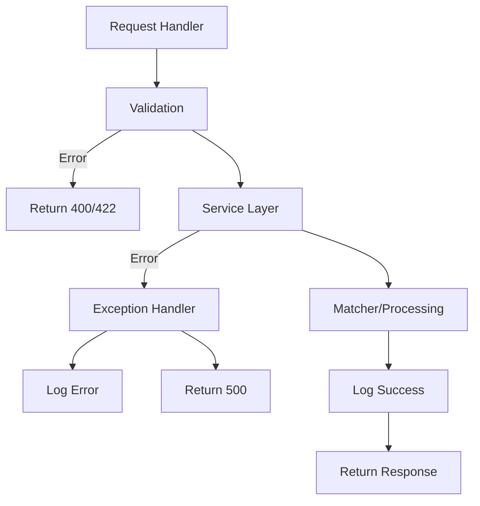

# Fuzzy Entity Matching API – Step-by-Step Debugging Flow

This document provides a detailed, step-by-step breakdown of the flow for each API endpoint, including which files and functions are used, what each step does, and where to look when debugging.

---

## 1. Health Check (`GET /health`)

**Flow:**
1. **Request**: Client sends `GET /health`
2. **Router**: `app/routers.py` → `create_health_router()`
   - Registers the `/health` endpoint.
3. **Handler**: `health_check()` (in `app/routers.py`)
   - Returns `{"status": "ok"}` (uses `HealthResponse` model from `app/models.py`)
   - Logs the request (`logger.debug`)
4. **Response**: Sent back to client

**Debugging Tips:**
- If you get a 500 error, check for import errors or logger misconfiguration.
- If the status is not `"ok"`, check the `health_check()` function.

---

## 2. Single Entity Match (`POST /match`)

**Flow:**
1. **Request**: Client sends `POST /match` with JSON body: `{"query": "Buro AG"}`
2. **Router**: `app/routers.py` → `create_matching_router()`
   - Registers the `/match` endpoint.
3. **Validation**: `MatchRequest` model (`app/models.py`)
   - Validates the request body.
   - If invalid, FastAPI returns 422 error.
4. **Handler**: `match_single_entity()` (in `app/routers.py`)
   - Calls `MatchingService.match_single_entity()` (`app/services.py`)
5. **Service Layer**: `MatchingService.match_single_entity()`
   - Checks for empty query (raises `ValueError` if empty)
   - Calls `FuzzyMatcher.match()` (`app/matcher.py`)
6. **Matcher Logic**: `FuzzyMatcher.match()`
   - Normalizes and standardizes the query and canonical entities
   - Computes scores: TF-IDF, Levenshtein, Token Set
   - Aggregates and sorts results
   - Returns top N matches with scores
7. **Response Construction**: `MatchResponse` model (`app/models.py`)
   - Formats the response with `top_match` and `alternatives`
8. **Logging**: Logs request, result, and errors (`logger.info`, `logger.error`)
9. **Error Handling**: 
   - Validation errors: 400/422
   - Internal errors: 500
10. **Response**: Sent back to client

**Debugging Tips:**
- If validation fails, check `MatchRequest` in `app/models.py`
- If scores look wrong, debug `FuzzyMatcher.match()` in `app/matcher.py`
- If you get a 500 error, check logs for stack trace

---

## 3. Batch Entity Match (`POST /match/batch`)

**Flow:**
1. **Request**: Client sends `POST /match/batch` with a CSV or JSON file (multipart/form-data)
2. **Router**: `app/routers.py` → `create_matching_router()`
   - Registers the `/match/batch` endpoint.
3. **File Validation**: `FileProcessingService.validate_file_type()` (`app/services.py`)
   - Checks file extension (must be `.csv` or `.json`)
   - Returns 400 error if invalid
4. **File Extraction**: `FileProcessingService.extract_names_from_file()` (`app/services.py`)
   - Reads file content
   - For CSV: uses pandas to extract the `names` column
   - For JSON: uses pandas to extract the `names` field
   - Returns 400 error if missing column/field
5. **Handler**: `match_batch_entities()` (in `app/routers.py`)
   - Calls `MatchingService.match_batch_entities()` (`app/services.py`)
6. **Service Layer**: `MatchingService.match_batch_entities()`
   - Iterates over each name
   - For each name:
     - Calls `FuzzyMatcher.match()` (`app/matcher.py`)
     - Gets top match and scores
     - Appends result (with `input`, `match`, `confidence`, `scores`, and `error` if any)
   - Handles and logs errors for each name
7. **Response Construction**: List of `BatchMatchResult` (`app/models.py`)
   - Each result includes `input`, `match`, `confidence`, `scores`, and `error`
8. **Logging**: Logs batch request, per-name errors, and completion
9. **Error Handling**: 
   - File errors: 400
   - Per-name errors: included in response with `error` field
   - Internal errors: 500
10. **Response**: Sent back to client

**Debugging Tips:**
- If file is rejected, check `validate_file_type()` and file extension
- If names are missing, check `extract_names_from_file()` and file format
- If scores are missing, check `FuzzyMatcher.match()` and `match_batch_entities()`
- If some names have errors, check the `error` field in the response

---

## 4. File/Function Reference Table

| Endpoint         | Router Function         | Service Function(s)                  | Model(s) Used           | Other Files/Functions                |
|------------------|------------------------|--------------------------------------|-------------------------|--------------------------------------|
| GET /health      | health_check           | -                                    | HealthResponse          | logging_config.py                    |
| POST /match      | match_single_entity    | MatchingService.match_single_entity   | MatchRequest, MatchResponse | FuzzyMatcher.match, logging_config.py |
| POST /match/batch| match_batch_entities   | FileProcessingService, MatchingService.match_batch_entities | BatchMatchResult        | FuzzyMatcher.match, pandas, logging_config.py |

---

## 5. Error & Logging Flow

---

## 6. Configuration Flow

- `.env` and `.env.example` → loaded by `app/config.py` (Settings)
- Used by all backend components for API title, CORS, weights, etc.
- Logging configuration is set up at startup

---

**Debugging Checklist:**
- Check logs in `app.log` and stdout for errors
- Use the error field in batch responses for per-name issues
- Validate request/response models in `app/models.py`
- Check file format and column/field names for batch uploads
- Use the function reference table to trace the flow for any endpoint
