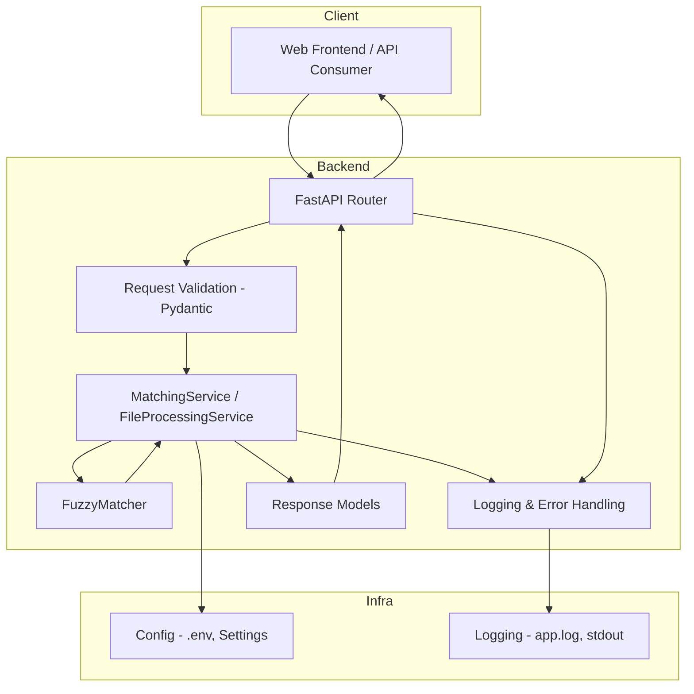
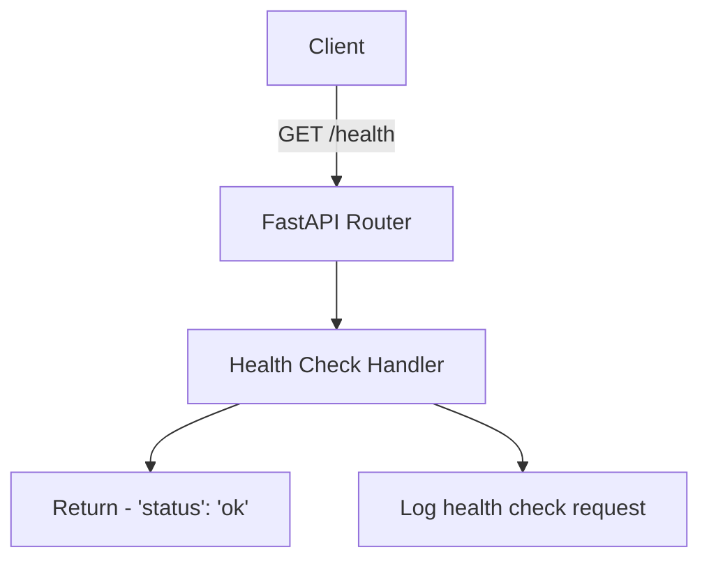
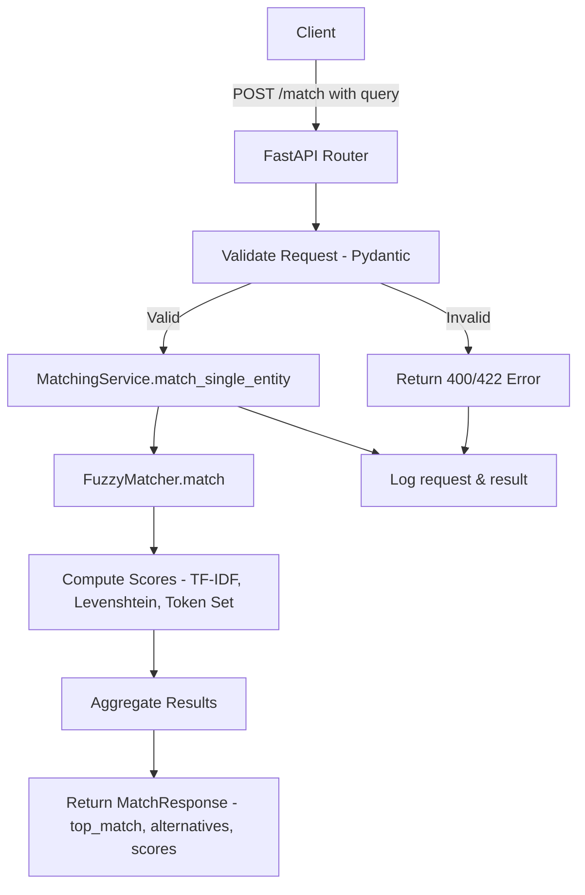
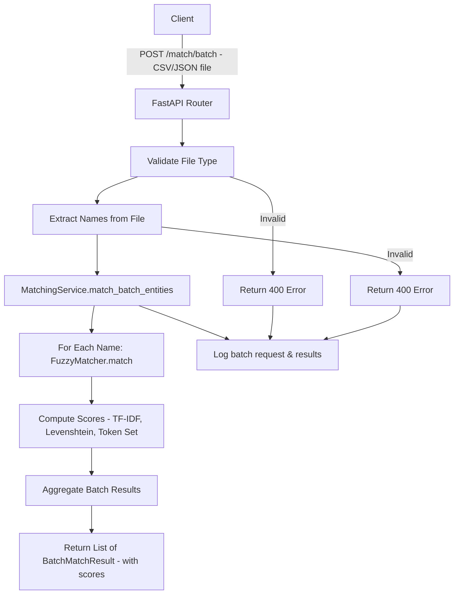
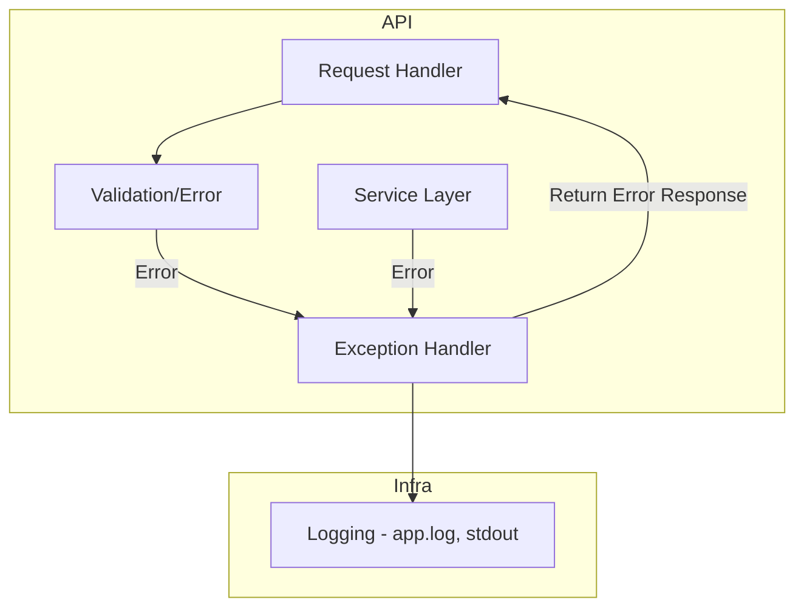
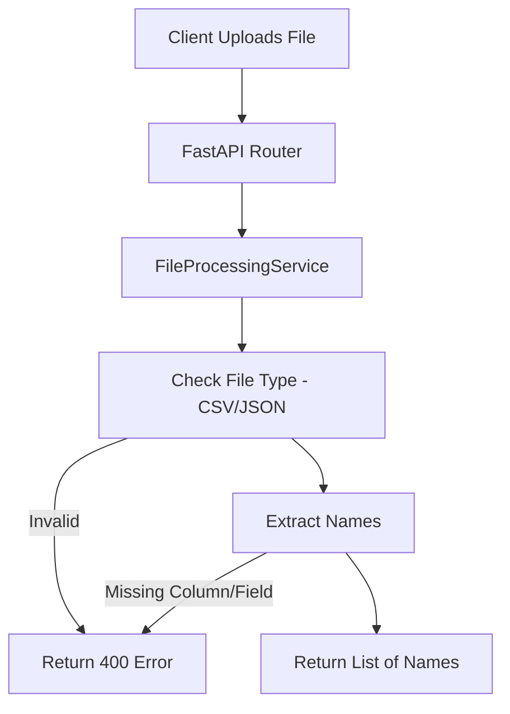
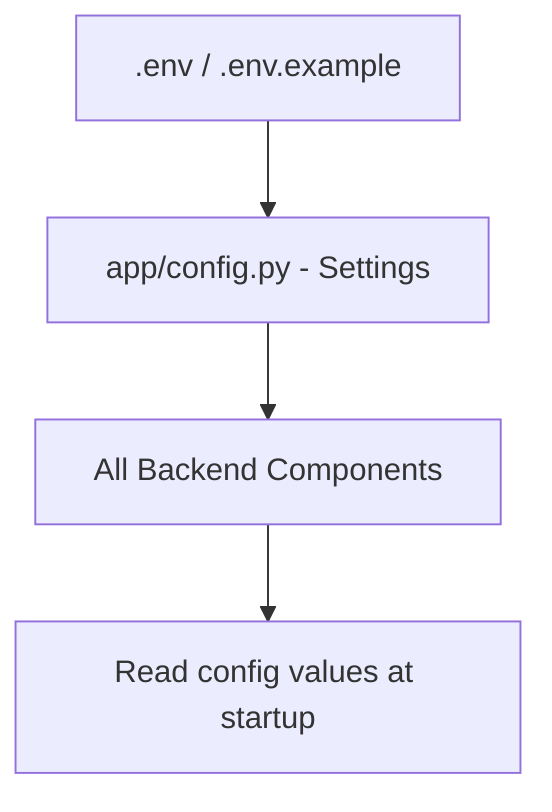
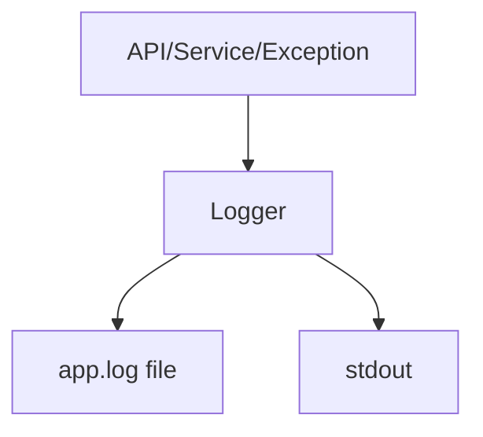

# Fuzzy Entity Matching API – Conceptual & Endpoint Flow Diagrams

## 1. System Overview



---

## 2. Health Check (`GET /health`)



---

## 3. Single Entity Match (`POST /match`)



---

## 4. Batch Entity Match (`POST /match/batch`)



---

## 5. Error Handling & Logging



---

## 6. File Processing (Batch Upload)



---

## 7. Configuration & Environment



---

## 8. Logging Flow



---

## 9. Response Models

**Single Match:**
```json
{
  "query": "Buro AG",
  "top_match": {
    "entity": "Büro AG",
    "confidence": 0.98,
    "scores": {
      "tfidf": 0.95,
      "levenshtein": 0.98,
      "token_set": 0.97
    }
  },
  "alternatives": [...]
}
```

**Batch Match:**
```json
[
  {
    "input": "Buro AG",
    "match": "Büro AG",
    "confidence": 0.93,
    "scores": {
      "tfidf": 0.95,
      "levenshtein": 0.98,
      "token_set": 0.97
    },
    "error": null
  }
]
```

---

**Legend:**
- **Client**: Frontend or API consumer
- **FastAPI Router**: Endpoint handler
- **Service Layer**: Business logic (MatchingService, FileProcessingService)
- **FuzzyMatcher**: Core matching logic
- **Logger**: Centralized logging
- **Config**: Environment and settings
