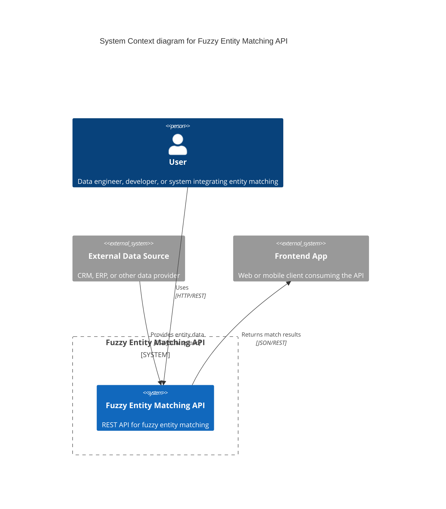
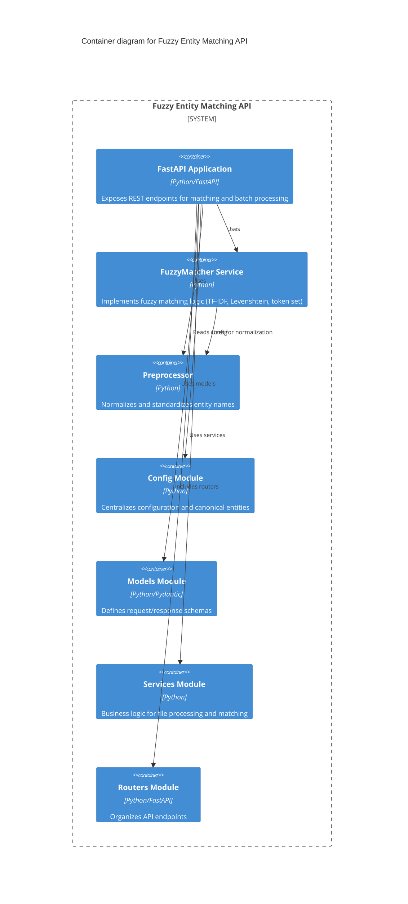

# C4 Documentation: Fuzzy Entity Matching API

## 1. System Context Diagram

**Explanation:**
- The Fuzzy Entity Matching API is used by data engineers, developers, or other systems.
- It receives entity data from external sources (e.g., CRM, ERP) and provides results to frontend apps or other consumers.

---

## 2. Container Diagram

**Explanation:**
- The FastAPI application is the main entry point, exposing REST endpoints.
- Business logic is separated into services, with dedicated modules for configuration, models, and routing.
- The matcher and preprocessor are core components for fuzzy matching and normalization.

---

## 3. Component & Code Diagrams (Optional)

For further detail, you can add C4 Component diagrams for each container, or sequence diagrams for request flows. Let me know if you want to visualize these as well!

---

**This C4 documentation provides a high-level architectural overview of the Fuzzy Entity Matching API, supporting onboarding, review, and future development.** 